### 关于APPROVE的相关操作

* 我们在做NFT mint或空投交互的时候会经常跟项目网站进行交互，在交互的过程中难免会授权小狐狸钱包，在授权的过程中项目方有可能就会获得钱包的所有权限。下面就教大家在mint之后如何取消授权来规避风险。

1、首选打开以太坊区块链浏览器，在首页右上角点击“more”；

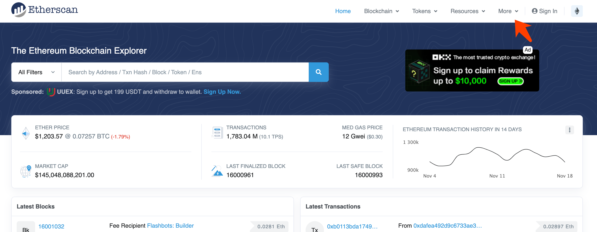

2、在点击“Token Approvals”令牌批准；

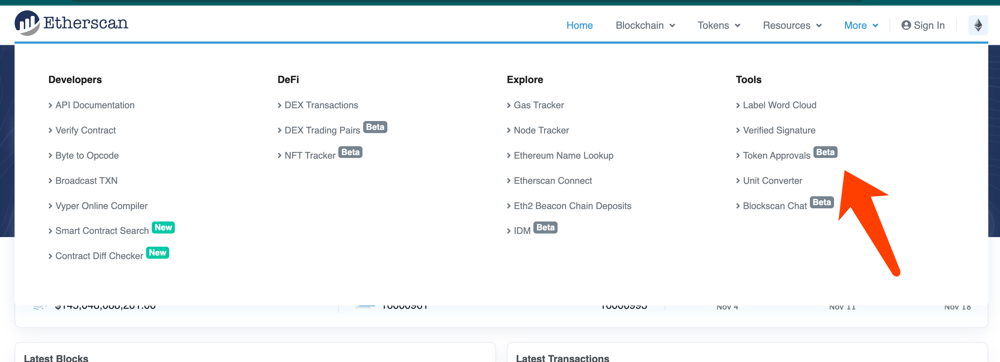 

3、然后链接小狐狸钱包；
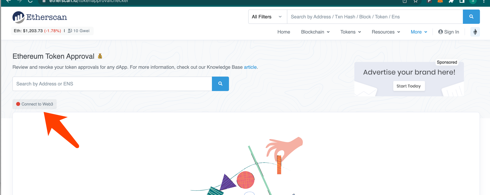 
 
4、点击确定；
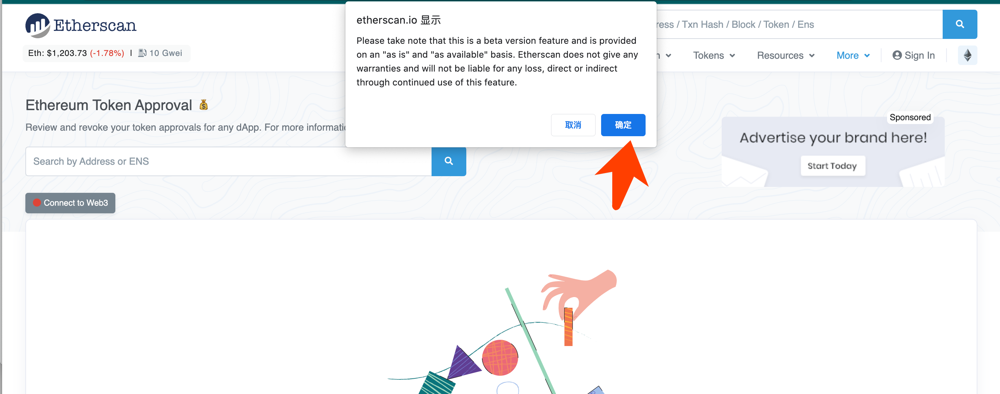 
 

5、选择小狐狸；
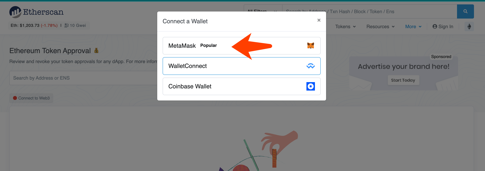  

6、小狐狸钱包需要再次输入密码
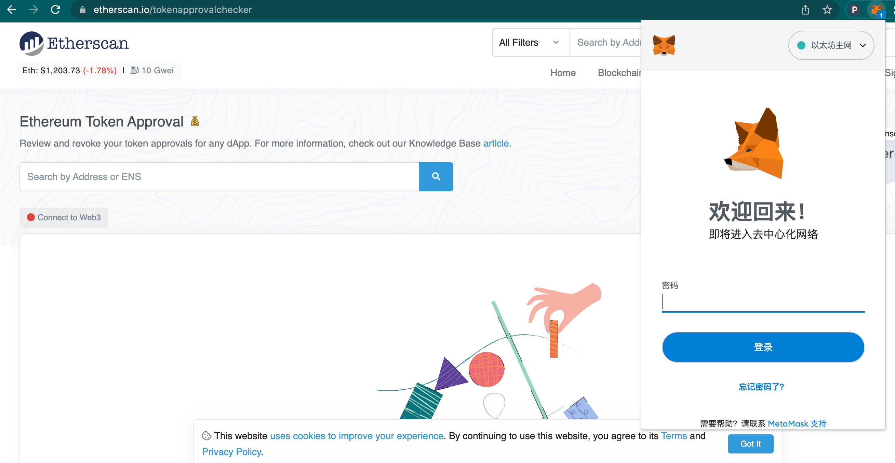  
 

7、这是三种不同协议的授权，取消NFT的授权就选择ERC-721；
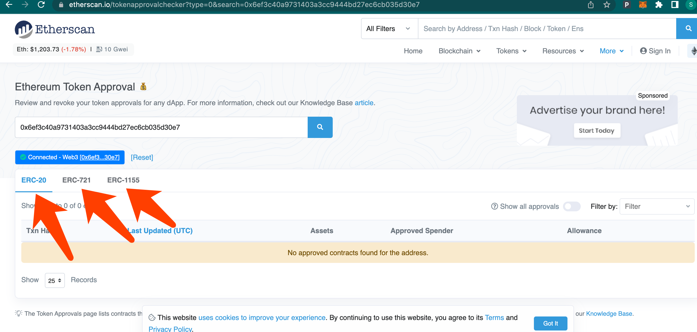  

8、找到你认为可疑的授权，点击Revoke取消授权；
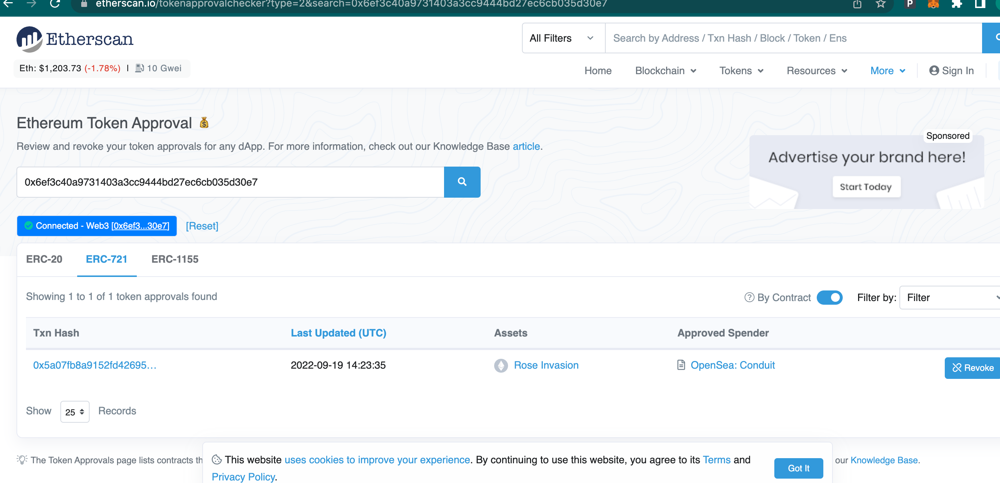 

9、确定移除授权；
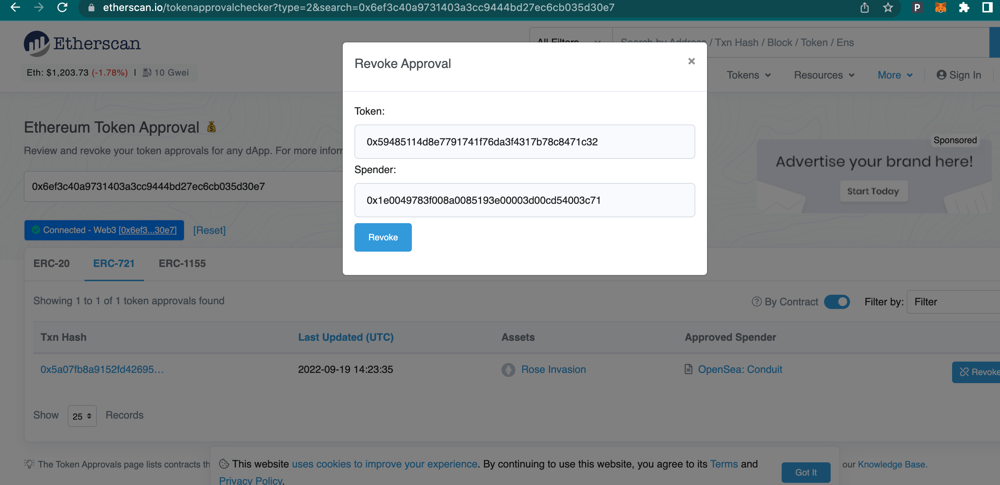 

10、需要再次输入密码；
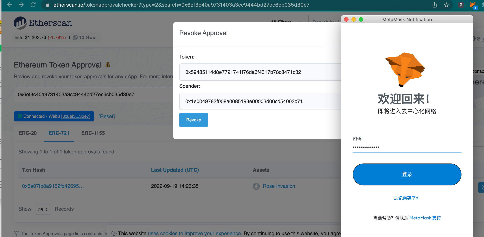 

11、最后需要小狐狸做个确认，需要支付一定的手续费。
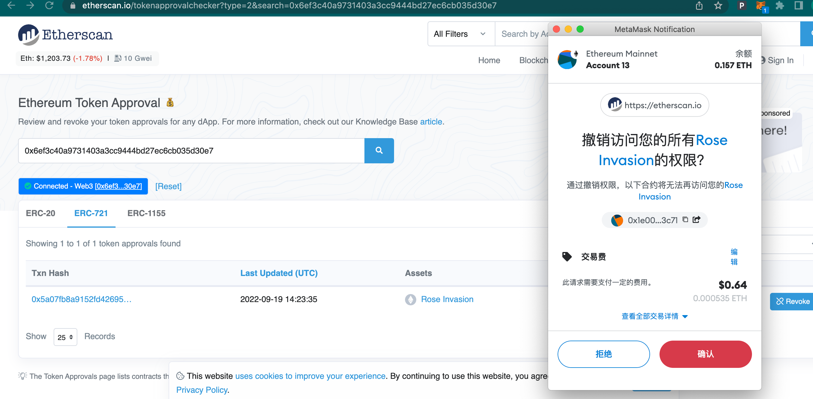 
