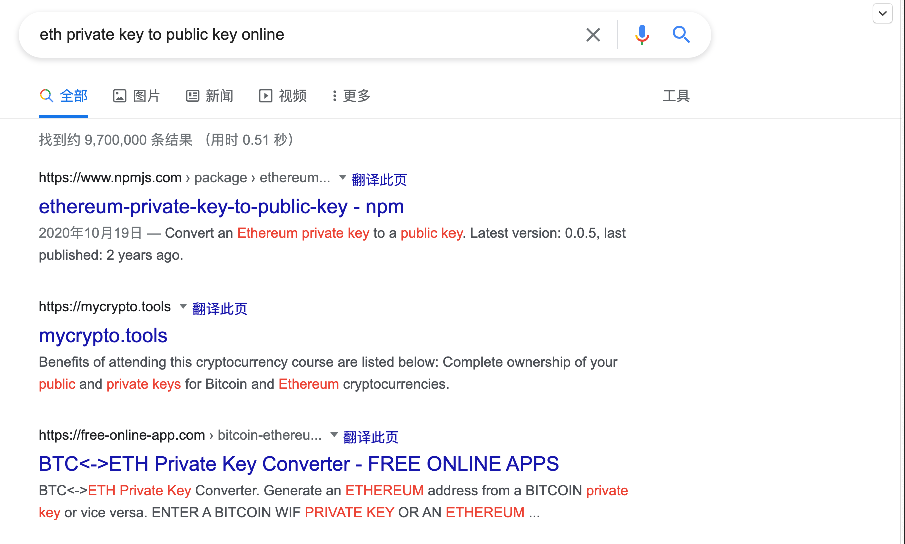

### 导论:
* 私钥作为防护你的地址安全的第一道屏障,记住一点:永远不要把你的私钥放在任何你不信任的地方!
* 私钥和助记词,是维护你的地址安全的最后一道屏障,
包括地址的安全(私钥和主记词和密码),智能合约的安全(不能授权过多的额度和现在流行的验证自己签名的函数,opensea使用的 )
* 第一:私钥方面:
* 私钥的安全性,不能把私钥放到网上



* 助记词的安全性,不要截图,不要拍照,以防撞库攻击

* 提供工具,生成BTC和ETH地址,等这些在线的工具最好不要使用,建议使用钱包
* BTC和ETH地址验证
* 加密你的私钥,这些工具也不能使用

## 现在流行的签名验证函数:
* 除非像现在opensea 和premint 已经验证过的签名,否则其他的不建议随便签名
* 一般的solidity 的安全合约的写法,

#### 后续的扩展工具

* 提供一些撞库被破解的范例和撞库的代码