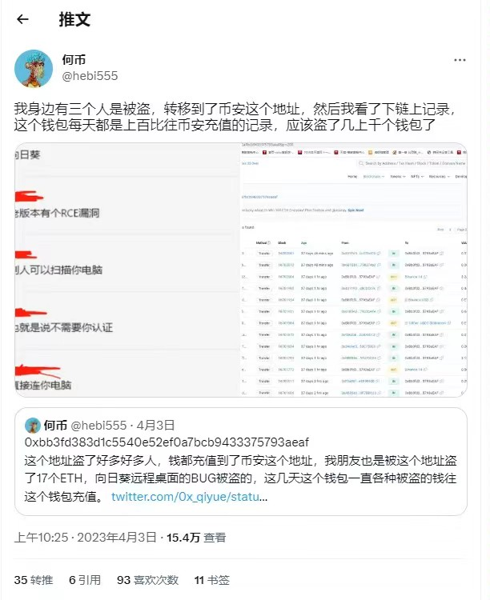

 # 关于向日葵引起的漏洞分析

向日葵远程控制软件，是 支持Windows、macOS、iOS、Android、Linux等平台，实现跨平台，多系统一键远控的软件，[https://sunlogin.oray.com/download]，目前暴露出，老版本的RCE（remote command/code execute）漏洞（尚未知道是哪个平台），可以允许攻击者未经允许就扫描安装者的电脑，造成入侵共计，引起资产损失。

 

为此，建议以下两点：
* 非必要不要使用向日葵，或者使用后尽可能马上删除软件
* 核心的资产放在冷钱包里面，不要存放在自己的常用电脑上。
* 在常用电脑上，保存私钥时，不保存完整的私钥，特殊的位数留空，后续方便自己加密使用。