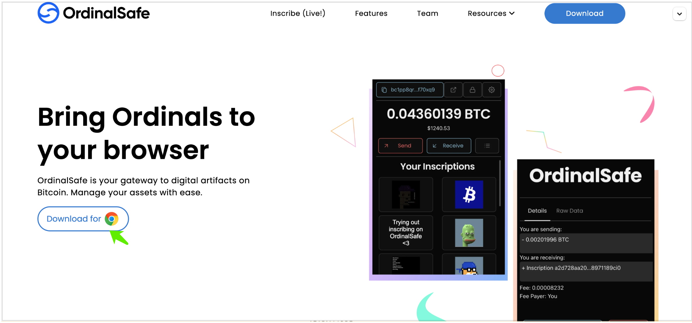
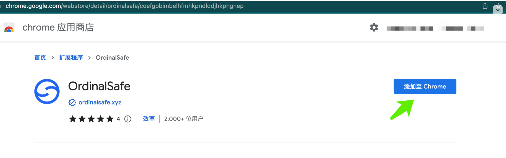
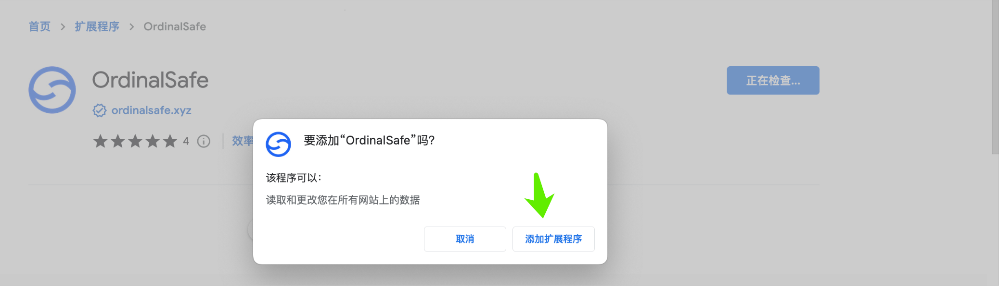
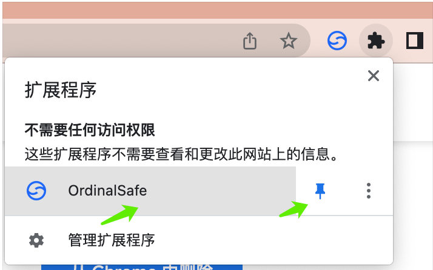
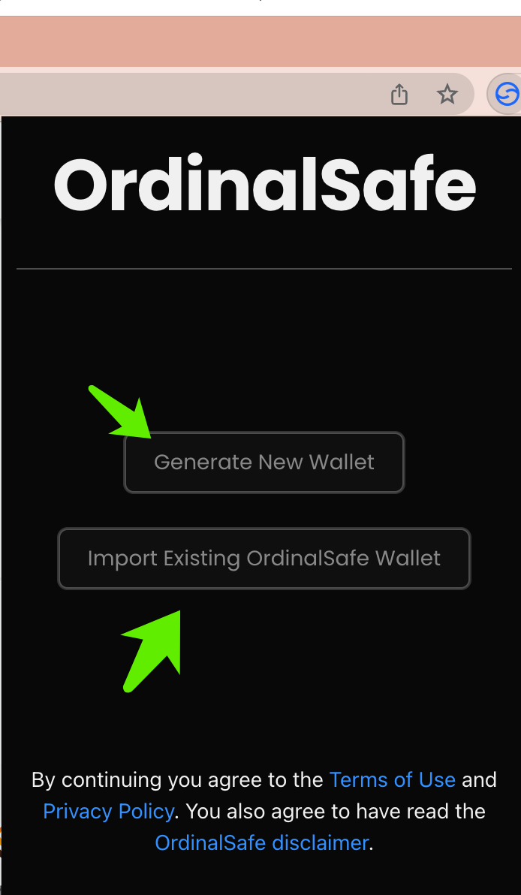

如下下载ordinalsafe 钱包
1，目前ordinalsafe只支持google chrome 浏览器。打开链接 https://ordinalsafe.xyz/，选择  Download  for ，选择 “添加至 Chrome”
 
 
 
2，选择 google chrome 的 “OrdinalSafe”后面的按钮，把OrdinalSafe 钱包固定在google chrome浏览器上
 
3， 选择Generate New Wallet，新创建一个钱包 （或者 “Importing Existing OridinalSafe Wallet”，导入已存在钱包）
 
4，设置专属的钱包密码，完成创建OrdinalSafe 的功能。
5，备份自己的每一个钱包